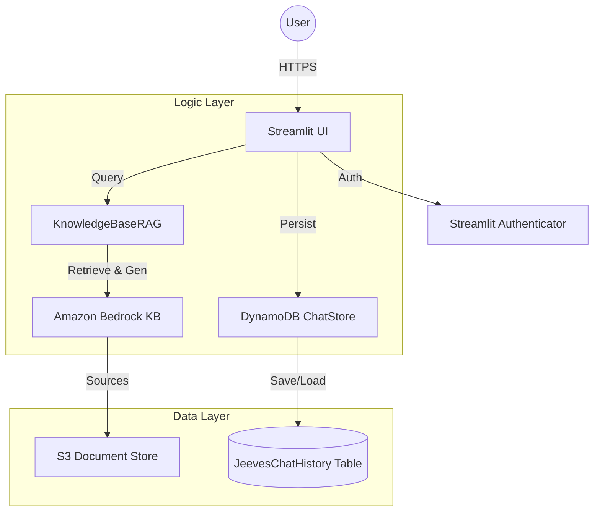

# 🏢 Jeeves: Enterprise RAG Assistant

Jeeves is a professional, session-aware AI assistant designed for the enterprise. Built with **Streamlit**, **Amazon Bedrock**, and **AWS DynamoDB**, it provides a secure and persistent conversational experience over your private business documents.

Inspired by the impeccable valet from P.G. Wodehouse's stories, Jeeves offers refined, context-aware assistance with an enterprise-grade UI.

---

## ✨ Key Features

- **🔐 Secure Authentication**: Integrated `streamlit-authenticator` with cookie-based persistence and `bcrypt` password hashing.
- **📚 Intelligent RAG**: Leverages Amazon Bedrock Knowledge Bases to query your private documents with verbatim citations.
- **💾 Persistent Chat History**: Conversations are stored in AWS DynamoDB, allowing users to resume chats across devices and sessions.
- **📊 Automatic Data Visualization**: Detects data trends and automatically renders interactive **Plotly** charts (Line, Bar, Pie, etc.).
- **💬 Multi-turn Continuity**: Uses Bedrock `sessionId` and manual context injection to maintain a cohesive "memory" during long conversations.
- **🎨 Premium Enterprise UI**: A polished "Glassmorphism" sidebar and centered login card with custom branding.

---

## 🏗️ Architecture



---

## 🚀 Getting Started

### 1. Prerequisites
- **Python 3.9+**
- **AWS Account** with Bedrock Knowledge Base and DynamoDB access.
- **AWS CLI** configured (via `aws configure` or SSO).

### 2. AWS Resources
Create the following resources in your AWS account:
- **DynamoDB Table**: `JeevesChatHistory`
  - Partition Key: `user_id` (String)
  - Sort Key: `conversation_id` (String)
- **Bedrock Knowledge Base**: Note your `KNOWLEDGE_BASE_ID` and `MODEL_ARN`.

### 3. Installation
```bash
# Clone the repository
git clone <your-repo-url>
cd Jeeves

# Create and activate virtual environment
python -m venv .venv
source .venv/bin/activate  # Or .venv\Scripts\activate on Windows

# Install dependencies
pip install -r requirements.txt
```

### 4. Configuration
Create a `.env` file in the root directory:
```env
KNOWLEDGE_BASE_ID=your_id_here
MODEL_ARN=arn:aws:bedrock:...foundation-model/anthropic.claude-3-5-sonnet-v2:0
AWS_DEFAULT_REGION=us-east-1
# OPTIONAL: if using specific credentials
# AWS_ACCESS_KEY_ID=...
# AWS_SECRET_ACCESS_KEY=...
```

Configure your users in `auth/config.yaml`:
```yaml
credentials:
  usernames:
    admin:
      email: admin@example.com
      name: Admin User
      password: <hashed_password_via_bcrypt>
```

### 5. Running the App
```bash
streamlit run app.py
```

---

## 🛠️ Tech Stack
- **Frontend**: [Streamlit](https://streamlit.io/)
- **Large Language Model**: [Anthropic Claude 3.5 Sonnet](https://www.anthropic.com/) via Amazon Bedrock.
- **Persistence**: [AWS DynamoDB](https://aws.amazon.com/dynamodb/)
- **Visualizations**: [Plotly Express](https://plotly.com/python/plotly-express/)
- **Authentication**: [Streamlit-Authenticator](https://github.com/mkhorasani/Streamlit-Authenticator)

---

## 🎩 Branding
The project uses custom branding located in `assets/logo.png`. To change the logo, simply replace this file with your own 200x200 pixel PNG.
